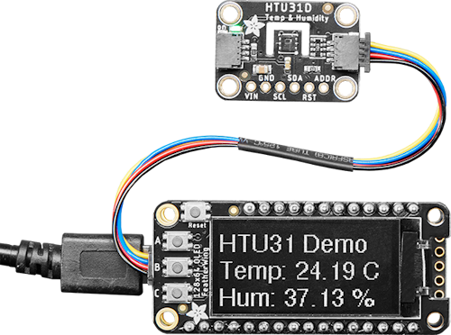

[Back to main page](./README.md)
<h1 align="center">
   Awesome Stemma QT
</h1>

> A curated list of awesome Stemma QT connector resources including Stemma QT-equipped microcontrollers, breakout boards and accessories.

Adafruit Stemma QT is a collection of solderless I2C connection products based on JST SH 1mm 4-pin connectors. 

For information on Stemma JST PH 2mm connectors, see [Awesome Stemma](./awesome-stemma.md)

## Contents

- [Stemma QT Hardware](#stemma-qt-hardware)
  - [Adafruit Microcontroller Boards with Stemma](#Adafruit-Microcontroller-Boards-with-Stemma-QT)
  - [Adafruit Sensors with Stemma QT](#Adafruit-Sensors-with-Stemma-QT)
  - [Adafruit Devices](#Adafruit-Devices)
  - [Adafruit Displays, Display Connectivity and Touch Controllers](#Adafruit-Displays,-Display-Connectivity-and-Touch-Controllers)
  - [Processor to Stemma/Grove/Qwiic Breakout Boards](#Processor-to-Stemma/Grove/Qwiic-Breakout-Boards)
- [Stemma QT Accessories](#stemma-qt-accessories)
  - [I2C Active Accessories](#I2C-Active-Accessories)
  - [Cables](#Cables)
  - [Breakouts](#Breakouts)
  - [Connectors](#Connectors)

## Stemma QT Hardware

You can find the up to date list of Adafruit Stemma QT hardware [on Adafruit](https://www.adafruit.com/category/1018).

### Adafruit Microcontroller Boards with Stemma QT

| Microcontroller Board | Stemma Connectors | Features |
|---|---|---|
| [PyBadge](https://www.adafruit.com/product/4200) | 1x Stemma QT, 2x Stemma | ATSAMD51J19, 512KB of Flash, 192KB RAM, 2MB Ext. Flash |
| [EdgeBadge](https://www.adafruit.com/product/4400) | 1x Stemma QT, 2x Stemma | ATSAMD51J19, 512KB of Flash, 192KB RAM, 2MB Ext. Flash |
| [PyGamer](https://www.adafruit.com/product/4242) | 1x Stemma QT, 2x Stemma | ATSAMD51J19, 512KB of Flash, 192KB RAM, 8MB Ext. Flash |
| [PyPortal](https://www.adafruit.com/product/4116) | 1x Stemma QT, 2x Stemma | ATSAMD51J20/ESP32, 512KB of Flash, 192KB RAM, 8MB Ext. Flash |
| [PyPortal Titano](https://www.adafruit.com/product/4444) | 1x Stemma QT, 2x Stemma | ATSAMD51J20/ESP32, 512KB of Flash, 192KB RAM, 8MB Ext. Flash |
| [PyPortal Pynt](https://www.adafruit.com/product/4465) | 1x Stemma QT, 2x Stemma | ATSAMD51J20/ESP32, 512KB of Flash, 192KB RAM, 8MB Ext. Flash |
| [Matrix Portal (M4)](https://www.adafruit.com/product/4745) | 1x Stemma QT | ATSAMD51J19 Cortex M4 processor, 512KB flash, 192K of SRAM, ESP32 WiFi |
| [Matrix Portal S3](https://www.adafruit.com/product/5778) | 1x Stemma QT | ESP32-S3 processor, 8 MB flash, 2 MB of SRAM, WiFi |
| [MagTag - 2.9" Grayscale E-Ink WiFi Display](https://www.adafruit.com/product/4800) | 1x Stemma QT, 2x Stemma | ESP32-S2, 2.9" grayscale eInk 296x128, WiFi |
| [MONSTER M4SK](https://www.adafruit.com/product/4343) | 1x Stemma QT, 2x Stemma | ATSAMD51G19, 512KB of Flash, 192KB RAM, 8MB Ext. Flash |
| [HalloWing M4 Express](https://www.adafruit.com/product/4300) | 1x Stemma QT, 2x Stemma | ATSAMD51J19, 512KB of Flash, 192KB RAM, 8MB Ext. Flash |
| [FunHouse - WiFi Home Automation Development Board](https://www.adafruit.com/product/4985) | 1x Stemma QT, 3 Stemma | ESP32-S2, 1.54" display, DPS310 & AHT20 sensors and more |
| [MEMENTO Camera](https://www.adafruit.com/product/5420) | 1x Stemma QT, 2x Stemma | ESP32-S3, 8MB Flash, 2MB PSRAM |
| [NeoTrellis M4](https://www.adafruit.com/product/3938) | 1 Stemma QT | ATSAMD51G19, 512KB Flash, 192KB RAM, 8MB Ext. Flash |
| [Metro Mini 328 V2](https://www.adafruit.com/product/2590) | 1 Stemma QT | ATmega328, 32KB Flash, 32KB RAM, 5V, 16 MHz |
| [Metro ESP32-S2](https://www.adafruit.com/product/4775) | 1 Stemma QT | ESP32-S2, 4MB Flash, 512MB SRAM, 2MB PSRAM, WiFi | 
| [Metro ESP32-S3](https://www.adafruit.com/product/5500) | 1 Stemma QT | ESP32-S3, 16MB Flash, 512MB SRAM, 8MB PSRAM, WiFi | 
| [Metro M7 with microSD - Featuring NXP iMX RT1011](https://www.adafruit.com/product/5600) | 1 Stemma QT | iMX RT1011, 8MB QSPI, 128 KB SRAM, microSD |
| [Metro M7 with AirLift - Featuring NXP iMX RT1011](https://www.adafruit.com/product/4950) | 1 Stemma QT | iMX RT1011, 8MB QSPI, 128 KB SRAM, WiFi coprocessor |
| [CLUE nRF52840 Express](https://www.adafruit.com/product/4500) | 1 Stemma QT | nRF52840, 1MB Flash, 256KB RAM, 2MB Ext. Flash |
| [QT Py SAMD21/M0](https://www.adafruit.com/product/4600) | 1 Stemma QT | SAMD21, 256KB Flash, 32KB RAM, USB-C |
| [QT Py RP2040](https://www.adafruit.com/product/4900) | 1 Stemma QT | RP2040, 8MB SPI Flash, 264KB RAM, USB-C |
| [QT Py ESP32 Pico](https://www.adafruit.com/product/5395) | 1 Stemma QT | ESP32, 8MB Flash, 2MB PSRAM, WiFi | 
| [QT Py ESP32-S2](https://www.adafruit.com/product/5325) | 1 Stemma QT | ESP32-S2, 4MB Flash, 2MB PSRAM, WiFi |
| [QT Py ESP32-S2 with uFL Antenna](https://www.adafruit.com/product/5348) | 1 Stemma QT | ESP32-S2, 4MB Flash, 2MB PSRAM, WiFi |
| [QT Py ESP32-S3](https://www.adafruit.com/product/5700) | 1 Stemma QT | ESP32-S3, 4MB Flash, 512MB SRAM, 2MB PSRAM | 
| [QT Py ESP32-S3](https://www.adafruit.com/product/5426) | 1 Stemma QT | ESP32-S3, 8MB Flash, 512MB SRAM, no PSRAM | 
| [QT Py ESP32-C3 WiFi](https://www.adafruit.com/product/5405) | 1 Stemma QT | ESP32-C3, 4MB Flash, 400KB SRAM |
| [ESP32 Feather V2 - 8MB Flash + 2 MB PSRAM](https://www.adafruit.com/product/5400) | 1 Stemma QT | ESP32, 8MB Flash, 2MB PSRAM, WiFi PCB Antenna |
| [ESP32 Feather V2 - 8MB Flash + 2 MB PSRAM w.FL](https://www.adafruit.com/product/5438) | 1 Stemma QT | ESP32, 8MB Flash, 2MB PSRAM, WiFi w.FL Antenna connector |
| [ESP32 Feather V2 with Headers - 8MB Flash + 2 MB PSRAM](https://www.adafruit.com/product/5900) | 1 Stemma QT | ESP32, 8MB Flash, 2MB PSRAM, WiFi |
| [ESP32-S2 Feather 4MB Flash / 2MB PSRAM](https://www.adafruit.com/product/5000) | 1 Stemma QT | ESP32-S2, 4MB Flash, 2MB PSRAM, WiFi |
| [Adafruit ESP32-S2 TFT Feather - 4MB Flash, 2MB PSRAM](https://www.adafruit.com/product/5300) | 1 Stemma QT | ESP32-S2, 4MB Flash, 2MB PSRAM, 240x135 TFT LCD display, WiFi |
| [Adafruit ESP32-S2 TFT Reverse Feather](https://www.adafruit.com/product/5345) | 1 Stemma QT | ESP32-S2, 4MB Flash, 2MB PSRAM, 240x135 TFT LCD display, WiFi |
| [ESP32-S3 Feather 4MB Flash / 2MB PSRAM](https://www.adafruit.com/product/5477) | 1 Stemma QT | ESP32-S3, 4MB Flash, 2MB PSRAM, WiFi |
| [ESP32-S3 Feather 8MB Flash / no PSRAM](https://www.adafruit.com/product/5323) | 1 Stemma QT | ESP32-S3, 8MB Flash, no PSRAM, WiFi |
| [ESP32-S3 Feather 8MB Flash w.FL Antenna](https://www.adafruit.com/product/5885) | 1 Stemma QT | ESP32-S3, 8MB Flash, no PSRAM, WiFi |
| [ESP32-S3 Feather V2](https://www.adafruit.com/product/5400) | 1 Stemma QT | ESP32-S3, 8MB Flash, 2MB PSRAM, WiFi |
| [ESP32-S3 Feather V2 with w.FL Antenna](https://www.adafruit.com/product/5400) | 1 Stemma QT | ESP32-S3, 8MB Flash, 2MB PSRAM, w.FL antenna connection for WiFi |
| [ESP32-S3 TFT Feather - 4MB Flash, 2MB PSRAM](https://www.adafruit.com/product/5483) | 1 Stemma QT | ESP32-S3, 4MB Flash, 2MB PSRAM, 240x135 pixel color TFT LCD |
| [ESP32-S3 Reverse TFT Feather - 4MB Flash, 2MB PSRAM](https://www.adafruit.com/product/5691) | 1 Stemma QT | ESP32-S3, 240x135 pixel color TFT LCD , 4MB Flash, 2MB PSRAM |
| [ESP32-S3 ProS3](https://www.adafruit.com/product/5401) | 1 Stemma QT | ESP32-S3, 16MB Flash, 8MB PSRAM, WiFi PCB antenna |
| [ESP32-S3 ProS3 u.FL Antenna](https://www.adafruit.com/product/5749) | 1 Stemma QT | ESP32-S3, 16MB Flash, 8MB PSRAM, WiFi u.FL antenna |
| [Feather RP2040](https://www.adafruit.com/product/4884) | 1 Stemma QT | RP2040, 8MB SPI Flash, 264KB RAM, USB-C |
| [Feather RP2040 with RFM95 LoRa Radio](https://www.adafruit.com/product/5714) | 1 Stemma QT | RP2040, 8MB SPI Flash, 264KB RAM, 868MHz or 915MHz LoRa, USB-C |
| [Feather RP2040 with RFM69 Packet Radio RadioFruit](https://www.adafruit.com/product/5712) | 1 Stemma QT | RP2040, 8MB SPI Flash, 264KB RAM, 868MHz or 915MHz Packet Radio, USB-C |
| [Feather RP2040 CAN Bus Feather](https://www.adafruit.com/product/5724) | 1 Stemma QT | RP2040, 8MB SPI Flash, 264KB RAM, MCP2515 CAN Controller, USB-C |
| [Feather RP2040 with USB Type A Host](https://www.adafruit.com/product/5723) | 1 Stemma QT | RP2040, 8MB SPI Flash, 264KB RAM, Type A USB Host Port, USB-C |
| [Feather RP2040 with DVI Output Port](https://www.adafruit.com/product/5710) | 1 Stemma QT | RP2040, SPI Flash, 264KB RAM, DVI Output Port, USB-C |
| [Feather RP2040 SCORPIO](https://www.adafruit.com/product/5650) | 1 Stemma QT | RP2040, 8MB SPI Flash, 264KB RAM, 8 Channel NeoPixel Driver, USB-C |
| [Feather RP2040 Adalogger](https://www.adafruit.com/product/5980) | 1 Stemma QT | RP2040, 8MB SPI Flash, 264KB RAM, microSD reader, USB-C |
| [Feather STM32F405 Express](https://www.adafruit.com/product/4382) | 1 Stemma QT | STM32F405 Cortex M4, 192KB RAM, 1MB Ext. Flash |
| [Trinkey QT2040](https://www.adafruit.com/product/5056) | 1 Stemma QT | RP2040, 8MB SPI Flash, 264KB RAM, USB A male |
| [ATtiny816 Breakout with seesaw](https://www.adafruit.com/product/5681) | 2 Stemma QT | ATtiny816, 512B RAM, 8KB Flash, 128 bytes EEPROM |
| [ATtiny817 Breakout with seesaw](https://www.adafruit.com/product/5233) | 2 Stemma QT | ATtiny816, 512B RAM, 8KB Flash, 128 bytes EEPROM |
| [ATtiny1616 Breakout with seesaw](https://www.adafruit.com/product/5690) | 2 Stemma QT | ATtiny1616, 2KB RAM, 16KB Flash, 256 bytes EEPROM |
| [MCP2221A](https://www.adafruit.com/product/4471) | 1 Stemma QT | General Purpose USB to GPIO ADC I2C |
| [FT232H](https://www.adafruit.com/product/2264) | 1 Stemma QT | General Purpose USB to GPIO, SPI, I2C - USB C |

### Adafruit Sensors with Stemma QT

| Board | Stemma Connectors | Features |
|---|---|---|
| [ADT7410](https://www.adafruit.com/product/4089) | 2 Stemma QT | High Accuracy I2C Temperature Sensor |
| [ADXL343](https://www.adafruit.com/product/4097) | 2 Stemma QT | Triple-Axis Accelerometer (+-2g/4g/8g/16g) with I2C/SPI |
| [ADXL343 + ADT7410 FeatherWing](https://www.adafruit.com/product/4147) | 1 Stemma QT | Triple-Axis Accelerometer (+-2g/4g/8g/16g) + Temperature |
| [ADXL345](https://www.adafruit.com/product/1231) | 2 Stemma QT | Triple-Axis Accelerometer (+-2g/4g/8g/16g) with I2C/SPI |
| [ADXL375](https://www.adafruit.com/product/5374) | 2 Stemma QT | High G Accelerometer (+-200g) with I2C and SPI |
| [AHT20](https://www.adafruit.com/product/4566) | 2 Stemma QT | Temperature & Humidity Sensor |
| [APDS9960](https://www.adafruit.com/product/3595) | 2 Stemma QT | Proximity, Light, RGB, and Gesture Sensor |
| [AS7341](https://www.adafruit.com/product/4698) | 2 Stemma QT | 10-Channel Light / Color Sensor |
| [BH1750](https://www.adafruit.com/product/4681) | 2 Stemma QT | Light Sensor |
| [BME680](https://www.adafruit.com/product/3660) | 2 Stemma QT | Temperature, Humidity, Pressure and Gas Sensor |
| [BME688](https://www.adafruit.com/product/5046) | 2 Stemma QT | Temperature, Humidity, Pressure and Gas Sensor |
| [BMP280](https://www.adafruit.com/product/2651) | 2 Stemma QT | Barometric Pressure & Altitude Sensor |
| [BMP388](https://www.adafruit.com/product/3966) | 2 Stemma QT | Precision Barometric Pressure & Altitude Sensor |
| [BMP390](https://www.adafruit.com/product/4816) | 2 Stemma QT | Precision Barometric Pressure & Altitude Sensor |
| [BNO055](https://www.adafruit.com/product/4646) | 2 Stemma QT | 9-DOF Absolute Orientation IMU Fusion |
| [BNO085](https://www.adafruit.com/product/4754) | 2 Stemma QT | 9-DOF Orientation IMU Fusion |
| [CCS811](https://www.adafruit.com/product/3566) | 2 Stemma QT | CCS811 Air Quality Sensor Breakout - VOC and eCO2 DISCONTINUED see SGP30 |
| [DPS310](https://www.adafruit.com/product/4494) | 2 Stemma QT | Precision Barometric Pressure / Altitude Sensor |
| [DS3502](https://www.adafruit.com/product/4286) | 2 Stemma QT | I2C Digital 10K Potentiometer |
| [ENS160](https://www.adafruit.com/product/5606) | 2 Stemma QT | MOX Gas Sensor - Sciosense CCS811 Upgrade |
| [H3LIS331](https://www.adafruit.com/product/4627) | 2 Stemma QT | Ultra High Range Triple-Axis Accelerometer |
| [HDC3021](https://www.adafruit.com/product/5989) | 2 Stemma QT | Precision Temperature & Humidity Sensor |
| [HTS221](https://www.adafruit.com/product/4535) | 2 Stemma QT | Temperature & Humidity Sensor Breakout Board |
| [HTU31](https://www.adafruit.com/product/4832) | 2 Stemma QT | Temperature & Humidity Sensor Breakout Board |
| [INA219](https://www.adafruit.com/product/904) | 2 Stemma QT | High Side DC Current Sensor Breakout - 26V ±3.2A Max |
| [INA228](https://www.adafruit.com/product/5832) | 2 Stemma QT | 20-bit High or Low Side Power Monitor |
| [ICM-20649](https://www.adafruit.com/product/4464) | 2 Stemma QT | Wide Range ±30g ±4000dps 6-DoF IMU |
| [ICM-20948](https://www.adafruit.com/product/4554) | 2 Stemma QT | TDK InvenSense 9-DoF IMU (MPU-9250 Upgrade) |
| [ISM330DHCX](https://www.adafruit.com/product/4502) | 2 Stemma QT | 6 DoF IMU - Accelerometer and Gyroscope |
| [ISM330DHCX + LIS3MDL](https://www.adafruit.com/product/4569) | 1 Stemma QT | High Precision 9-DoF IMU FeatherWing |
| [LIS3DH](https://www.adafruit.com/product/2809) | 2 Stemma QT | Triple-Axis Accelerometer (+-2g/4g/8g/16g) |
| [LIS2MDL](https://www.adafruit.com/product/4488) | 2 Stemma QT | Triple-axis Magnetometer |
| [LIS3MDL](https://www.adafruit.com/product/4479) | 2 Stemma QT | Triple-axis magnetometer compass module |
| [LIS331HH](https://www.adafruit.com/product/4626) | 2 Stemma QT | Triple-Axis Wide-Range ±24g Accelerometer |
| [LPS22HB](https://www.adafruit.com/product/4633) |  2 Stemma QT | Pressure Sensor 260 to 1260 hPa, 24-bit, 75Hz |
| [LPS25HB](https://www.adafruit.com/product/4530) | 2 Stemma QT | Pressure Sensor 260-1260 hPa, 24-bit, 25Hz |
| [LPS33HW](https://www.adafruit.com/product/4414) | 2 Stemma QT | Water resistant pressure sensor |
| [LSM6DS3TR-C](https://www.adafruit.com/product/4503) | 2 Stemma QT | 6-DoF Accel + Gyro IMU |
| [LSM6DS3TR-C + LIS3MDL](https://www.adafruit.com/product/5543) | 2 Stemma QT | Precision 9 DoF IMU |
| [LSM6DS33](https://www.adafruit.com/product/4480) | 2 Stemma QT | 6 DoF IMU accelerometer + gyroscope DISCONTINUED |
| [LSM6DS33 + LIS3MDL](https://www.adafruit.com/product/4485) | 2 Stemma QT | 9 DoF IMU with accelerometer, gyroscope, magnetometer DISCONTINUED |
| [LSM6DSO32](https://www.adafruit.com/product/4692) | 2 Stemma QT | 6-DoF Accelerometer and Gyroscope |
| [LSM6DSOX](https://www.adafruit.com/product/4438) | 2 Stemma QT | An I2C/SPI 6 DoF accelerometer and gyroscope |
| [LSM6DSOX + LIS3MDL](https://www.adafruit.com/product/4517) | 2 Stemma QT | Precision 9 DoF IMU |
| [LSM6DSOX + LIS3MDL FeatherWing](https://www.adafruit.com/product/4565) | 2 Stemma QT | Precision 9 DoF IMU |
| [LSM9DS1](https://www.adafruit.com/product/4634) | 2 Stemma QT | 9-DOF sensor |
| [LSM303AGR](https://www.adafruit.com/product/4413) | 2 Stemma QT | Triple-axis accelerometer/magnetometer compass module |
| [LTR-303](https://www.adafruit.com/product/5610) | 2 Stemma QT | Light Sensor |
| [LTR-329](https://www.adafruit.com/product/5591) | 2 Stemma QT | Light Sensor |
| [LTR390](https://www.adafruit.com/product/4831) | 2 Stemma QT | UV Light Sensor |
| [MCP9808](https://www.adafruit.com/product/5027) | 2 Stemma QT | High Accuracy I2C Temperature Sensor Breakout |
| [MLX90393](https://www.adafruit.com/product/4022) | 2 Stemma QT | Wide-Range Triple-axis Magnetometer |
| [MLX90640](https://www.adafruit.com/product/4407) | 2 Stemma QT | Thermal Camera Breakout - 55 Degree FoV |
| [MLX90640](https://www.adafruit.com/product/4469) | 2 Stemma QT | Thermal Camera Breakout - 110 Degree FoV |
| [MMC5603](https://www.adafruit.com/product/5579) | 2 Stemma QT | Triple-axis Magnetometer |
| [MPR121](https://www.adafruit.com/product/1982) | 2 Stemma QT | 12-Key Capacitive Touch Sensor Breakout |
| [MPU-6050](https://www.adafruit.com/product/3886) | 1 Stemma QT | An I2C 6 DoF accelerometer and gyroscope |
| [MS8607](https://www.adafruit.com/product/4716) | 2 Stemma QT | Pressure Humidity Temperature PHT Sensor |
| [MSA301](https://www.adafruit.com/product/4344) | 2 Stemma QT | Low Cost Triple Axis Accelerometer DISCONTINUED |
| [MSA311](https://www.adafruit.com/product/5309) | 2 Stemma QT | Triple Axis Accelerometer |
| [NAU7802](https://www.adafruit.com/product/4538) | 2 Stemma QT | 24-Bit ADC for strain gauges / load cells |
| [PA1010D Mini GPS](https://www.adafruit.com/product/4415) | 2 Stemma QT | GPS, GLONASS, GALILEO, QZSS receiver, 1"x1" |
| [PCT2075](https://www.adafruit.com/product/4369) | 2 Stemma QT | Temperature Sensor, LM75 upgrade |
| [PMSA003I](https://www.adafruit.com/product/4632) | 2 Stemma QT | Air Quality Breakout |
| [SCD-30](https://www.adafruit.com/product/4867) | 2 Stemma QT | NDIR True CO2 Temperature and Humidity Sensor |
| [SCD-40](https://www.adafruit.com/product/5187) | 2 Stemma QT | True CO2, Temperature and Humidity Sensor |
| [SCD-41](https://www.adafruit.com/product/5190) | 2 Stemma QT | True CO2 Temperature and Humidity Sensor |
| [SGP40](https://www.adafruit.com/product/4829) | 2 Stemma QT | Air Quality Sensor Breakout - VOC Index |
| [SHTC3](https://www.adafruit.com/product/4636) | 2 Stemma QT | Sensirion Temperature & Humidity Sensor |
| [SHT31-D](https://www.adafruit.com/product/2857) | 2 Stemma QT | Sensirion Temperature & Humidity Sensor |
| [SHT40](https://www.adafruit.com/product/4885) | 2 Stemma QT | Sensirion Temperature & Humidity Sensor |
| [SHT41](https://www.adafruit.com/product/5776) | 2 Stemma QT | Sensirion Temperature & Humidity Sensor |
| [SHT45](https://www.adafruit.com/product/5665) | 2 Stemma QT | Sensirion Precision Temperature & Humidity Sensor |
| [Si7021](https://www.adafruit.com/product/3251) | 2 Stemma QT | Temperature & Humidity Sensor |
| [TLV493D](https://www.adafruit.com/product/4366) | 2 Stemma QT | Triple-Axis magnetometer |
| [TMP117](https://www.adafruit.com/product/4821) | 2 Stemma QT | ±0.1°C High Accuracy I2C Temperature Sensor |
| [TSC2007](https://www.adafruit.com/product/5423) | 2 Stemma QT | I2C Resistive Touch Screen Controller |
| [TSL2591](https://www.adafruit.com/product/1980) | 2 Stemma QT | High Dynamic Range Digital Light Sensor |
| [VCNL4020](https://www.adafruit.com/product/5810) | 2 Stemma QT | Proximity and Light Sensor |
| [VCNL4040](https://www.adafruit.com/product/4161) | 2 Stemma QT | Proximity and Lux sensor |
| [VEML7700](https://www.adafruit.com/product/4162) | 2 Stemma QT | Lux Sensor - I2C Light Sensor |
| [VEML7700](https://www.adafruit.com/product/5378) | 2 Stemma QT | Right Angle Lux Sensor - I2C Light Sensor |
| [VL53L0X](https://www.adafruit.com/product/3317) | 2 Stemma QT | Time of Flight Distance Sensor - ~30 to 1000mm |
| [VL53L1X](https://www.adafruit.com/product/3967) | 2 Stemma QT | Time of Flight Distance Sensor - ~30 to 4000mm |
| [VL53L4CD](https://www.adafruit.com/product/5396) | 2 Stemma QT | Time of Flight Distance Sensor - ~1 to 1300mm |
| [VL53L4CX](https://www.adafruit.com/product/5425) | 2 Stemma QT | Time of Flight Distance Sensor - ~1 to 6000mm |
| [VL6180X](https://www.adafruit.com/product/3316) | 2 Stemma QT | Time of Flight Distance Ranging Sensor |

### Adafruit Devices

| Board | Stemma Connectors | Features |
|---|---|---|
| [NeoDriver - I2C to NeoPixel Driver](https://www.adafruit.com/product/5766) | 2 Stemma QT | WS2812 / SK6812 to I2C driver |
| [ScoutMakes FM Radio](https://www.adafruit.com/product/5651) | 2 Stemma QT | RDA5807 based FM radio |
| [LED Glasses Front Panel - 116 RGB LEDs with I2C Driver](https://www.adafruit.com/product/5210) | 2 Stemma QT | 116 arranged 2x2mm RGB LEDs using an IS31FL3741 I2C Driver |
| [16x9 Charlieplexed PWM LED Matrix Driver - IS31FL3731](https://www.adafruit.com/product/2946) | 2 Stemma QT | I2C LED driver to PWM LEDs in a 16x9 grid |
| [LED Arcade Button 1x4 - STEMMA QT I2C Breakout](https://www.adafruit.com/product/5296) | 2 Stemma QT, 8 x JST XH | 4 arcade button connections, 4 button LED connections |
| [Mini I2C Gamepad with seesaw](https://www.adafruit.com/product/5743) | 1 Stemma QT | 2-axis thumb joystick and 6 momentary buttons (4 large and 2 small) |
| [NeoKey 1x4 QT I2C - Four Mechanical Key Switches with NeoPixels](https://www.adafruit.com/product/4980) | 2 Stemma QT | Four Mechanical Key Switches with 4 NeoPixels |
| [Wii Nunchuck Breakout Adapter](https://www.adafruit.com/product/4836) | 2 Stemma QT | Wii Nunchuck I2C breakout |
| [NeoSlider I2C QT Slide Potentiometer with 4 NeoPixels](https://www.adafruit.com/product/5295) | 2 Stemma QT | I2C slide potentiometer + 4 NeoPixels |
| [Rotary Encoder Breakout without Encoder](https://www.adafruit.com/product/4991) | 2 Stemma QT | Rotary Encoder (without encoder) |
| [Rotary Encoder Breakout with Encoder](https://www.adafruit.com/product/5880) | 2 Stemma QT | Rotary Encoder (with encoder soldered) |
| [Quad Rotary Encoder Breakout without Encoders](https://www.adafruit.com/product/5752) | 2 Stemma QT | Four rotary encoder to I2C (encoders not included) |
| [ANO Rotary Navigation Encoder to I2C](https://www.adafruit.com/product/5740) | 2 Stemma QT | ANO rotary encoder wheel to I2C (wheel not included) |
| [DS1841 10K Digital Log Potentiometer](https://www.adafruit.com/product/4570) | 2 Stemma QT | Digital 10K ohm logarithmic taper potentiometer |
| [DS2484 I2C to 1-Wire Bus](https://www.adafruit.com/product/5976) | 2 Stemma QT | I2C to 1-Wire Bus Adapter Breakout |
| [DS3231 Precision Real Time Clock (RTC)](https://www.adafruit.com/product/5188) | 2 Stemma QT | Precise real time clock module |
| [DS3502 10K Digital Linear Potentiometer](https://www.adafruit.com/product/4286) | 2 Stemma QT | Digital 10K ohm linear taper potentiometer | [DS3231 Precision Real Time Clock (RTC)](https://www.adafruit.com/product/5188) | 2 Stemma QT | Precise real time clock module |
| [PCF8523 Real Time Clock (RTC)](https://www.adafruit.com/product/5189) | 2 Stemma QT | Real time clock module |
| [EMC2101 I2C PC Fan Controller and Temperature Sensor](https://www.adafruit.com/product/4808) | 2 Stemma QT | Four pin PC fan control |
| [Si5351A Clock Generator](https://www.adafruit.com/product/5640) | 2 Stemma QT | 8KHz to 160MHz clock generator |
| [DRV2605L Haptic Motor Controller](https://www.adafruit.com/product/2305) | 2 Stemma QT | Haptic (vibration) motor controller |
| [Mini GPS PA1010D](https://www.adafruit.com/product/4415) |  2 Stemma QT | Mini GPS with UART and I2C |
| [TRUST M SLS 32AIA](https://www.adafruit.com/product/4351) | 2 Stemma QT | OPTIGA Trust M RSA 1K/2K + ECC256/384 Crypto |
| [ATECC608](https://www.adafruit.com/product/4314) | 2 Stemma QT | Crypto ECDH and AES-128, SHA-256/HMAC hash |
| [24LC32 I2C EEPROM](https://www.adafruit.com/product/5146) | 2 Stemma QT | 32Kbit / 4KB storage |
| [ST25DV16K RFID EEPROM](https://www.adafruit.com/product/4701) | 2 Stemma QT | I2C ISO/IEC 15693 (13.56MHz) RFID EEPROM |
| [AD5693R 16-Bit DAC with I2C Interface](https://www.adafruit.com/product/5811) | 2 Stemma QT | 16 bit DAC temperature compensated 2.5V internal reference |
| [MCP4728 Quad DAC](https://www.adafruit.com/product/4470) | 2 Stemma QT | Four 12-bit DACs with integrated EEPROM for settings |
| [PCF8591 Quad ADC + DAC](https://www.adafruit.com/product/4648) | 2 Stemma QT | Quad 8-bit ADC + 8-bit DAC |
| [ADS7830 8-Channel 8-Bit ADC](https://www.adafruit.com/product/5836) | 2 Stemma QT | 8-Channel 8-Bit ADC with I2C |
| [MCP3421 ADC](https://www.adafruit.com/product/5870) | 2 Stemma QT | 18-Bit ADC | 
| [NAU7802 24-Bit ADC](https://www.adafruit.com/product/4538) | 2 Stemma QT | 24-bit ADC |
| [MCP9601 (MCP96L01) I2C Thermocouple Amplifier](https://www.adafruit.com/product/5165) | 2 Stemma QT | Works with K, J, T, N, S, E, B, and R type thermocouples |
| [TCA8418 Keypad Matrix and GPIO Expander](https://www.adafruit.com/product/4918) | 2 Stemma QT | Up to 18 total 'I/O' pins, 10 columns and 8 rows |
| [AW9523 GPIO Expander and LED Driver](https://www.adafruit.com/product/4886) | 2 Stemma QT | 16 I/O pins, four I2C address options |
| [PCF8574 I2C GPIO Expander](https://www.adafruit.com/product/5545) | 2 Stemma QT | 8 I/O pins, three I2C address options |
| [PCF8575 I2C GPIO Expander](https://www.adafruit.com/product/5611) | 2 Stemma QT | 16 I/O pins, multiple I2C address options |
| [MCP23017 I2C GPIO Expander Breakout](https://www.adafruit.com/product/5346) | 2 Stemma QT | 16 I/O pins, 8 I2C address options |
| [MCP23017 I2C GPIO Expander Raspberry Pi Bonnet](https://www.adafruit.com/product/4132) | 2 Stemma QT | 16 I/O pins, 8 I2C address options |
| [MAX17048 LiPoly / LiIon Fuel Gauge and Battery Monitor](https://www.adafruit.com/product/5580) | 2 Stemma QT | Voltage and percentage |
| [LC709203F LiPoly / LiIon Fuel Gauge and Battery Monitor](https://www.adafruit.com/product/4712) | 2 Stemma QT | Voltage and percentage |
| [CYBERDECK HAT for Raspberry Pi 400](https://www.adafruit.com/product/4863) | 2x Stemma / 2x Stemma QT | Extend GPIO, room for a display |
| [CYBERDECK Bonnet for Raspberry Pi 400](https://www.adafruit.com/product/4862) | 2x Stemma / 2x Stemma QT | Extend GPIO, room for a display |
| [PiCowbell Proto for Pico](https://www.adafruit.com/product/5200) | 2 Stemma QT | Reset Button & STEMMA QT |
| [Terminal PiCowbell for Pico without header](https://www.adafruit.com/product/5904) | 2 Stemma QT | Screw Terminals, Reset Button |
| [Terminal PiCowbell for Pico with Pre-Soldered Sockets](https://www.adafruit.com/product/5907) | 2 Stemma QT | Screw Terminals, Headers, Reset Button |
| [PiCowbell Adalogger for Pico - MicroSD, RTC](https://www.adafruit.com/product/5703) | 1 Stemma QT | MicroSD card slot, real-time clock, backup battery holder |
| [PiCowbell CAN Bus for Pico](https://www.adafruit.com/product/5728) | 1 Stemma QT | MCP2515 CAN Controller and TJA1051/3 transceiver |
| [Proto Under Plate PiCowBell for Pico](https://www.adafruit.com/product/5905) | 1 Stemma QT | Reset Button & STEMMA QT |
| [Proto Doubler PiCowbell for Pico and Pico W](https://www.adafruit.com/product/5906) | 1 Stemma QT | LiPo Battery Charger, On/Off Switch, Reset Switch |
| [PC Joystick to seesaw I2C Adapter](https://www.adafruit.com/product/5753) | 2 Stemma QT | Read 15 pin D-Sub PC joystick to I2C |
| [S-35710 Low-Power Wake Up Timer Breakout](https://www.adafruit.com/product/5959) | 2 Stemma QT | Low-Power Wake Up Timer Breakout |

### Adafruit Displays, Display Connectivity and Touch Controllers

| Display | Stemma Connectors | Features |
|---|---|---|
| [OLED Graphics](https://www.adafruit.com/product/4440) | 1 Stemma QT | 128x32 0.91" monochrome OLED breakout |
| [Monochrome OLED Bonnet](https://www.adafruit.com/product/4567) | 1 Stemma QT | 128x32 2.23" mono OLED for Raspberry Pi |
| [OLED Graphics](https://www.adafruit.com/product/326) | 2 Stemma QT | 128x64, 0.96" monochrome OLED breakout |
| [Monochrome OLED Display](https://www.adafruit.com/product/938) | 1 Stemma QT | 128x64 1.3" monochrome OLED  |
| [Monochrome OLED Display FeatherWing](https://www.adafruit.com/product/4650) | 1 Stemma QT | 128x64 1.3" monochrome OLED |
| [Monochrome OLED Display](https://www.adafruit.com/product/5297) | 2 Stemma QT | 128x128, 1.12" monochrome OLED breakout |
| [Grayscale 1.5" 128x128 OLED Graphic Display](https://www.adafruit.com/product/4741) | 2 Stemma QT | 128x128 1.5" greyscale OLED |
| [Mini PiTFT](https://www.adafruit.com/product/4393) | 1 Stemma QT | 135x240 pixel, 1.14", Raspberry Pi connector |
| [Mini PiTFT](https://www.adafruit.com/product/4484) | 1 Stemma QT | 240x240 pixel, 1.3", Raspberry Pi connector, 2 buttons |
| [Color TFT Bonnet](https://www.adafruit.com/product/4506) | 1 Stemma QT | 240x240 pixel, 1.3" color TFT, Joystick, for Raspberry Pi |
| [2.8" TFT Touch Shield for Arduino with Resistive Touch Screen v2](https://www.adafruit.com/product/1651) | 1 Stemma QT | 2.8" 240x320 color TFT display with Resistive Touch Screen |
| [TFT FeatherWing - 3.5" 480x320 Capacitive Touchscreen](https://www.adafruit.com/product/5872) | 1 Stemma QT | 3.5" 480x320 color TFT, Capacitive Touchscreen, FeatherWing |
| [TSC2007 I2C Resistive Touch Screen Controller](https://www.adafruit.com/product/5423) | 2 Stemma QT | I2C Resistive Touch Screen Controller |
| [Monochrome E-Ink Bonnet](https://www.adafruit.com/product/4687) | 1 Stemma QT | 250x122 pixel, 2.13", mono eInk for Raspberry Pi |
| [EYESPI Pi Beret - Buttons, EYESPI and STEMMA QT](https://www.adafruit.com/product/5783) | 1 Stemma QT | Raspberry Pi connectivity for Stemma QT and EYESPI display |
| [TFP401 HDMI/DVI Decoder to 40-Pin TTL Breakout - With Touch](https://www.adafruit.com/product/2219) | 1 Stemma QT | Mini HDMI decoder board to TTL display interface |
| [Matrix Portal S3 Internet Display](https://www.adafruit.com/product/5778) | 1x Stemma QT, 1x Stemma | ESP32-S3, 8MB Flash, 2PM PSRAM, drives LED matrix displays |
| [Pimoroni Interstate 75 - RP2040 LED Matrix Driver - PIM584](https://www.adafruit.com/product/5342) | 1 Stemma QT | HUB75 LED matrix driver with RP2040 |
| [IS31FL3741 13x9 PWM RGB LED Matrix Driver](https://www.adafruit.com/product/5201) | 2 Stemma QT | 117 RGB LEDs, 2x2mm in size, in a 13x9 grid with 3mm pitch spacing |
| [Quad Alphanumeric Display backpack](https://www.adafruit.com/product/1910) | 2 Stemma QT | For four 0.54" height digits - backpack only |
| [Quad Alphanumeric Display 4 Digits](https://www.adafruit.com/product/1911) | 2 Stemma QT | Five single color displays available, 0.54" height digits backpack + displays to solder on |
| [Quad Alphanumeric Display 4 Digits Assembled](https://www.adafruit.com/product/5599) | 2 Stemma QT | Five single color displays available, 0.54" height digits, backpack+display assembled |
| [1.2" 8x8 LED Matrix Backpack](https://www.adafruit.com/product/1048) | 2 Stemma QT | 8x8 LED driver backpack (no display included) |
| [I2C / SPI Character LCD Backpack](https://www.adafruit.com/product/292) |  1 Stemma QT | Works with 20x4 or 16x2 LCD displays (but not 16x2 OLED) |
| [Turing Complete Labs 10 Digit Monochrome LCD Display](https://www.adafruit.com/product/5379) | 2 Stemma QT | 10 digit monochrome LCD display |

### Processor to Stemma/Grove/Qwiic Breakout Boards

| Breakout | Connectors | Features |
|---|---|---|
| [Adafruit Qwiic / Stemma QT 5 Port Hub](https://www.adafruit.com/product/5625) | 5 Stemma QT / Qwiic | Distribution hub |
| [SparkFun Qwiik / Stemma QT FeatherWing](https://www.adafruit.com/product/4515) | 4 Qwiic / Stemma QT | Feather processor form factor (FeatherWing) |
| [Binho Qwiic / Stemma QT Interface Board](https://www.adafruit.com/product/4461) | 4 Qwiic / Stemma QT | Binho ribbon cable to Qwiic/Stemma QT connections in Feather format |
| [Binho Qwiic / Stemma QT Interface Board](https://www.adafruit.com/product/4462) | 4 Qwiic / Stemma QT | Binho ribbon cable to Qwiic/Stemma QT connections |
| [SparkFun Stemma QT / Qwiic Mux Breakout - 8 Channel](https://www.adafruit.com/product/4704) | 8 Qwiic / Stemma QT | Connect 8 devices to one address |
| [SparkFun Qwiic / STEMMA QT HAT for Raspberry Pi](https://www.adafruit.com/product/4688) | 4 Qwiic / Stemma QT | Raspberry Pi GPIO 4 port I2C breakout |
| [Piunora Pro Carrier for Raspberry Pi 4 Module by Diodes Delight](https://www.adafruit.com/product/5404) | 1 Stemma QT | Raspberry Pi 4CM carrier and breakout |
| [Piunora Lite Carrier for Raspberry Pi 4 Module by Diodes Delight](https://www.adafruit.com/product/5403) | 1 Stemma QT | Raspberry Pi 4CM carrier and breakout |

### Qwiic Boards from SparkFun

- [Qwiic Main Page](https://www.sparkfun.com/qwiic) on Sparkfun.com
- [One page list of Qwiic products from SparkFun](https://cdn.sparkfun.com/assets/home_page_posts/3/1/7/7/SparkFun_s_Qwiic_Ecosystem.pdf)

## Stemma QT Accessories

### I2C Active Accessories
| Vendor | Item | Connectors | Features |
|---|---|---|---|
| Adafruit | [LTC4316 I2C Address Translator](https://www.adafruit.com/product/5914) | 2 Stemma QT | Changes the I2C address of the device connected to input as seen by controller at output |
| Adafruit | [LTC4311 I2C Extender / Active Terminator](https://www.adafruit.com/product/4756) | 2 Stemma QT | Terminates and extends I2C bus |
| Adafruit | [PCA9546 4-Channel STEMMA QT / Qwiic I2C Multiplexer - TCA9546A Compatible](https://www.adafruit.com/product/5664) | 5 Stemma QT | Provides 4 channel control of I2C devices with same address |
| Adafruit | [PCA9548 8-Channel STEMMA QT / Qwiic I2C Multiplexer - TCA9548A Compatible](https://www.adafruit.com/product/5626) | 9 Stemma QT | Provides 8 channel control of I2C devices with same address |
| Adafruit | [ISO1540 Bidirectional I2C Isolator](https://www.adafruit.com/product/4903) | 2 Stemma QT | TI ISO1540 is fully bi-directional, supports up to 1 MHz clock rates, supports clock-stretching, works with 3 to 5V DC power or logic (separate on either side), with 2500 V-RMS isolation |
| Adafruit | [QT 3V to 5V Level Booster Breakout](https://www.adafruit.com/product/5649) | 2 Stemma QT | 3V to 5V signal level booster |
| Adafruit | [QT 5V to 3V Level Shifter Breakout](https://www.adafruit.com/product/5637) | 2 Stemma QT | 5V to 3V signal level shifter |
| Adafruit | [TCA4307 Hot-Swap I2C Buffer with Stuck Bus Recovery](https://www.adafruit.com/product/5159) | 2 Stemma QT | Hot-plug buffer |
| SparkFun | [STEMMA QT / Qwiic TCA9548A Mux Breakout - 8 Channel](https://www.adafruit.com/product/4704) | 10 Stemma QT | TCA9548A Multiplexer 2 upstream, 8 downstream |

### Cables

Note: lengths are approximate

| Vendor | Connector type(s) | Length | Connector 1 | Connector 2 |
|---|---|---|---|---|
| Adafruit | [Stemma QT - Stemma QT](https://www.adafruit.com/product/4399) | 50mm | 4-pin JST SH female | 4-pin JST SH female |
| Adafruit | [Stemma QT - Stemma QT](https://www.adafruit.com/product/4210) | 100mm | 4-pin JST SH female | 4-pin JST SH female |
| Adafruit | [5-pin Arduino MKR ESLOV - Stemma QT](https://www.adafruit.com/product/4483) | 100mm | 5-pin JST SJ | 4-pin JST SH |
| Adafruit | [Grove - Stemma QT/Qwiic](https://www.adafruit.com/product/4528) | 100mm | 4-pin JST SH female | Grove 4 Pin |
| Adafruit | [Stemma QT - Pin Header Socket](https://www.adafruit.com/product/4397) | 150mm | 4-pin JST SH female | 4 Female pin header sockets |
| Adafruit | [Stemma QT - Pin Header Jack](https://www.adafruit.com/product/4209) | 150mm | 4-pin JST-SH female | 0.1" male pin headers |
| Adafruit | [Stemma QT - Alligator Clips](https://www.adafruit.com/product/4398) | 150mm | 4-pin JST SH | 4 Alligator Clips |
| Adafruit | [Stemma QT - Stemma QT](https://www.adafruit.com/product/4401) | 200mm | 4-pin JST SH female | 4-pin JST SH female |
| Adafruit | [Stemma - Stemma QT](https://www.adafruit.com/product/4424) | 200mm  | 4-pin JST PH female | 4-pin JST SH female |
| Adafruit | [Stemma QT - Stemma QT](https://www.adafruit.com/product/5384) | 300mm | 4-pin JST SH | 4-pin JST SH |
| Adafruit | [Stemma QT - Stemma QT](https://www.adafruit.com/product/5385) | 400mm | 4-pin JST SH | 4-pin JST SH |
| Adafruit | [Stemma QT - Micro SMT Test Hooks](https://www.adafruit.com/product/5037) | - | 4-pin JST SH | Micro SMT Test Hooks |

### Breakouts

| Vendor | Item | Features |
|---|---|---|
| SparkFun | [SparkFun Qwiic Multiport (Works with Stemma QT)](https://www.adafruit.com/product/4861) | 4 port Qwiic / Stemma QT hub |
| SparkFun | [Stemma QT / Qwiic Adapter](https://www.adafruit.com/product/4527) | 2 Qwiic / Stemma QT connectors, pinouts for SCL/SDA/3V/GND |
| SparkFun | [Stemma QT/Qwiic Shim for Raspberry Pi](https://www.adafruit.com/product/4463) | Press fit Raspberry Pi GPIO to Stemma QT/Qwiic connector |
| SparkFun | [Qwiic pHAT v2.0 for Raspberry Pi](https://www.adafruit.com/product/5142) | 4 port Qwiic / Stemma QT + power for Raspberry Pi header |
| SparkFun | [SparkFun Qwiic / STEMMA QT HAT for Raspberry Pi](https://www.adafruit.com/product/4688 ) | 4 port Qwiic / Stemma QT for Raspberry Pi header |
| SparkFun | [SparkFun Qwiic / Stemma QT FeatherWing (Shield for Thing Plus)](https://www.adafruit.com/product/4515) | 4 port Qwiic / Stemma QT with Feather pinout |

### Connectors

| Vendor | Item | Quantity |
|---|---|---|
| Adafruit | [JST SH 4-pin right angle connector](https://www.adafruit.com/product/4208) | 10 pack |
| Adafruit | [JST SH 4-pin vertical connector](https://www.adafruit.com/product/4328) | 10 pack |

### Third Party Devices 

| Vendor & Item | Connections | Features |
|---|---|---|
| [I2CMini by Excamera Labs](https://www.adafruit.com/product/4970) | 1 Stemma QT | USB to I2C interface |

## License & Trademarks

To the extent possible under law, the authors have waived all copyright and related or neighbouring rights to this work.

Updated: April 2, 2024
