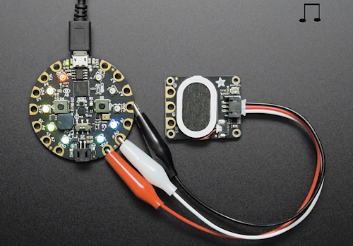

[Back to main page](./README.md)
<h1 align="center">
   Awesome Stemma
</h1>

> A curated list of awesome Stemma connector resources including Stemma-equipped microcontrollers and breakout boards.

Adafruit Stemma is a collection of solderless digital/analog/power connection standards based on JST PH 2mm 3 and 4 pin connectors. 

Stemma used the JST PH 2mm connector while Stemma QT uses the JST SH 1mm 3 pin connector. For Stemma QT see [Awesome Stemma QT](./awesome-stemma-qt.md).

Stemma equipped boards may be compatible with Seed Studio Grove connectors. See the [main page](./README.md) for more. 

## Contents

- [Stemma Hardware](#stemma-hardware)
  - [Adafruit Microcontroller Boards with Stemma](#Adafruit-Microcontroller-Boards-with-Stemma)
  - [Adafruit Sensors with Stemma](#Adafruit-Sensors-with-Stemma)
  - [Adafruit Devices](#Adafruit-Devices)
  - [Adafruit Displays and Display Connectivity](#Adafruit-Displays-and-Display-Connectivity)
- [Accessories](#accessories)
  - [Cables](#Cables)
  - [Connectors](#Connectors)

## Stemma Hardware

You can find the up to date list of Adafruit Stemma hardware [on Adafruit](https://www.adafruit.com/category/1019).

### Adafruit Microcontroller Boards with Stemma

| Microcontroller Board | Stemma Connectors | Features |
|---|---|---|
| [PyBadge](https://www.adafruit.com/product/4200) | 1x Stemma QT, 2x 3 pin Stemma | ATSAMD51J19, 512KB of Flash, 192KB RAM, 2MB Ext. Flash |
| [EdgeBadge](https://www.adafruit.com/product/4400) | 1x Stemma QT, 2x 3 pin Stemma | ATSAMD51J19, 512KB of Flash, 192KB RAM, 2MB Ext. Flash |
| [PyGamer](https://www.adafruit.com/product/4242) | 1x Stemma QT, 2x 3 pin Stemma | ATSAMD51J19, 512KB of Flash, 192KB RAM, 8MB Ext. Flash |
| [PyPortal](https://www.adafruit.com/product/4116) | 1x Stemma QT, 2x 3 pin Stemma | ATSAMD51J20/ESP32, 512KB of Flash, 192KB RAM, 8MB Ext. Flash |
| [PyPortal Titano](https://www.adafruit.com/product/4444) | 1x Stemma QT, 2x 3 pin Stemma | ATSAMD51J20/ESP32, 512KB of Flash, 192KB RAM, 8MB Ext. Flash |
| [PyPortal Pynt](https://www.adafruit.com/product/4465) | 1x Stemma QT, 2x 3 pin Stemma | ATSAMD51J20/ESP32, 512KB of Flash, 192KB RAM, 8MB Ext. Flash |
| [MagTag - 2.9" Grayscale E-Ink WiFi Display](https://www.adafruit.com/product/4800) | 1x Stemma QT, 2x Stemma | ESP32-S2, 2.9" grayscale eInk 296x128, WiFi |
| [NeoTrellis M4 Mainboard](https://www.adafruit.com/product/3938) | 1x 4 pin Stemma | ATSAMD51, 512KB Flash 192KB RAM, 8MB SPI Flash, 4x8 NeoPixels |
| [MONSTER M4SK](https://www.adafruit.com/product/4343) | 1x Stemma QT, 2x 3 pin Stemma | ATSAMD51G19, 512KB of Flash, 192KB RAM, 8MB Ext. Flash |
| [HalloWing M4 Express](https://www.adafruit.com/product/4300) | 1x Stemma QT, 2x 3 pin Stemma | ATSAMD51J19, 512KB of Flash, 192KB RAM, 8MB Ext. Flash |
| [FunHouse - WiFi Home Automation Development Board](https://www.adafruit.com/product/4985) | 1x Stemma QT, 3 Stemma | ESP32-S2, 1.54" display, DPS310 & AHT20 sensors and more |
| [MEMENTO Camera](https://www.adafruit.com/product/5420) | 1x Stemma QT, 2x 3 pin Stemma | ESP32-S3, 8MB Flash, 2MB PSRAM |

### Adafruit Sensors with Stemma

| Board | Stemma Connectors | Features |
|---|---|---|
| [STEMMA Soil Sensor](https://www.adafruit.com/product/4026) | 1 Stemma | Capacitive I2C smart soil sensor |
| [TMP235](https://www.adafruit.com/product/4686) | 1 Stemma | Analog Temperature Sensor |
| [TSL2561](https://www.adafruit.com/product/3611) | 1 Stemma  | Digital lux / light sensor |
| [TSL2591](https://www.adafruit.com/product/1980) | 2 Stemma  | High dynamic range digital light sensor |

### Adafruit Devices

| Board | Stemma Connectors | Features |
|---|---|---|
| [Soil Sensor](https://www.adafruit.com/product/4026) | 1 Stemma | I2C capacitive moisture sensor |
| [NeoRGB Stemma](https://www.adafruit.com/product/5888) | 1 Stemma | NeoPixel to RGB PWM LEDs and Strips |
| [NeoTrellis RGB Driver](https://www.adafruit.com/product/3954) | 1 Stemma | Provides a 4x4 matrix of RGB NeoPixel lit elastomer keys |
| [MOSFET Driver](https://www.adafruit.com/product/5648) | 1 Stemma | For driving motors, solenoids, LEDs, etc. |
| [Analog SPDT Switch](https://www.adafruit.com/product/5892) | 1 Stemma | MAX4544 SPDT analog switch for signals up to 12V |
| [Stemma Speaker](https://www.adafruit.com/product/3885) | 1 Stemma | A class D audio amplifier and an oval speaker |
| [Mini Relay, Nonlatching](https://www.adafruit.com/product/4409) | 1 Stemma | A single pole/double throw relay up to 250V AC or DC |
| [NeoPixel Strip](https://www.adafruit.com/product/3919) | 1 Stemma | 60 pixels per meter density, 30 pixels 0.5 meter |
| [NeoPixel Driver BFF Add-On for QT Py and Xiao](https://www.adafruit.com/product/5645) | 1 Stemma | Easily connect a NeoPixel Strip with Stemma to QT Py/Xiao |
| [NeoTrellis RGB Driver PCB for 4x4 Keypad](https://www.adafruit.com/product/3954) | 1 Stemma | 4x4 elastomer button and RGB LED controller |
| [High Power Infrared LED Emitter](https://www.adafruit.com/product/5639) | 1 Stemma | Two high powered ultraviolet LED outputs |
| [Tactile Push Buttons](https://www.adafruit.com/product/4431) | 1 Stemma each | Pack of 5 breakaway tactile buttons |
| [Micro Servo](https://www.adafruit.com/product/4326) | 1 Stemma | Standard micro servo with Stemma connector |
| [10K Analog Linear Potentiometer](https://www.adafruit.com/product/4493) | 1 Stemma | Wired Potentiometer Breakout Board with a 10K ohm linear taper |
| [Audio Amp - Mono 2.5W Class D](https://www.adafruit.com/product/5647) | 1 Stemma | Mono amplifier able to deliver up to 2.5 Watts into 4-8 ohm impedance speakers |
| [Piezo Driver Amp - PAM8904](https://www.adafruit.com/product/5791) | 1 Stemma | PAM8904-based piezo (buzzer) driver |
| [CYBERDECK HAT for Raspberry Pi 400](https://www.adafruit.com/product/4863) | 2x Stemma / 1x Stemma QT | Extend GPIO, room for a display |

### Adafruit Displays and Display Connectivity

| Display | Stemma Connectors | Features |
|---|---|---|
| [TFT Gizmo](https://www.adafruit.com/product/4367) | 2x 3 pin Stemma | 240x240 pixel, 1.54", round for Circuit Playground |
| [E-Ink Gizmo](https://www.adafruit.com/product/4428) | 2x 3 pin Stemma | 152x152 pixel, 1.54", tricolor, round for Circuit Playground DISCONTINUED |
| [Tricolor E-Ink Gizmo](https://www.adafruit.com/product/4869) | 2x 3 pin Stemma | 200x200 pixel, 1.54", tricolor, round for Circuit Playground DISCONTINUED |
| [Matrix Portal](https://www.adafruit.com/product/4745) | 1x 3 pin Stemma | LED Matrix Driver Board with ATSAMD51 + ESP32 |
| [Matrix Portal S3 Internet Display](https://www.adafruit.com/product/5778) | 1x Stemma QT, 1x Stemma | ESP32-S3, 8MB Flash, 2PM PSRAM, drives LED matrix displays |

## Accessories

### Cables

Note: lengths are approximate

| Vendor | Connector type(s) | Length | Connector 1 | Connector 2 |
|---|---|---|---|---|
| Adafruit | [Stemma - Stemma](https://www.adafruit.com/product/3568) | 100mm | 4-pin JST PH female |  4-pin JST PH female |
| Adafruit | [Stemma - Stemma](https://www.adafruit.com/product/4336) | 100mm | 3-pin JST PH female |  3-pin JST PH female |
| Adafruit | [Stemma - Stemma](https://www.adafruit.com/product/3568) | 150mm | 4-pin JST PH female |  4-pin JST PH female |
| Adafruit | [Stemma QT -  4-pin JST PH female](https://www.adafruit.com/product/4209) | 150mm | 4-pin JST-PH female | 0.1" male pin headers |
| Adafruit | [Stemma  - Alligator clips](https://www.adafruit.com/product/4030) | 195mm | 3-pin JST PH | 3 Alligator Clips |
| Adafruit | [Stemma  - Alligator clips](https://www.adafruit.com/product/4029) | 195mm | 4-pin JST PH | 4 Alligator Clips |
| Adafruit | [Stemma - Stemma QT](https://www.adafruit.com/product/4424) | 200mm  | 4-pin JST PH female | 4-pin JST SH female |
| Adafruit | [Stemma 3 wire - leads](https://www.adafruit.com/product/4046) | 200mm | 3-pin JST PH male | 3 tinned wires |
| Adafruit | [Stemma 4 wire hooded male - leads](https://www.adafruit.com/product/4045) | 200mm | 4-pin JST PH male socket | 4 color wires |
| Adafruit | [Stemma 3 wire - male headers](https://www.adafruit.com/product/3893) | 200mm | 3-pin JST PH female | 0.1" male pin headers |
| Adafruit | [Stemma -  4 Male Pin Headers](https://www.adafruit.com/product/3955) | 200mm | 4-pin JST PH | 0.1" male pin headers |
| Adafruit | [Stemma -  4 Female Pin Headers](https://www.adafruit.com/product/3894) | 200mm | 4-pin JST PH | 0.1" female pin headers |
| Adafruit | [Stemma 3 wire hooded male and Stemma Female to leads (matched pair)](https://www.adafruit.com/product/5087) | 200mm each | 3-pin JST PH male 2mm to wires | 3-pin JST PH 2mm female to wires |
| Adafruit | [Stemma 4 wire hooded male and Stemma Female to leads (matched pair)](https://www.adafruit.com/product/5088) | 200mm each | 4-pin JST PH male 2mm to wires | 4-pin JST PH 2mm female to wires |

### Connectors

| Vendor | Item | Quantity |
|---|---|---|
| Adafruit | [JST PH 4-pin horizontal connector](https://www.adafruit.com/product/4392) | 10 pack |
| Adafruit | [JST PH 3-pin vertical connector](https://www.adafruit.com/product/4389) | 10 pack |
| Adafruit | [JST PH 4-pin vertical connector](https://www.adafruit.com/product/4390) | 10 pack |
| Adafruit | [JST PH 3-pin horizontal connector](https://www.adafruit.com/product/4391) | 10 pack |
| Adafruit | [JST PH 0.2mm connector kit](https://www.adafruit.com/product/4422) | 220 pieces |

## License & Trademarks

To the extent possible under law, the authors have waived all copyright and related or neighbouring rights to this work.

Updated: March 19, 2024
